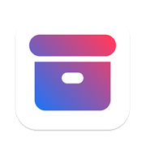
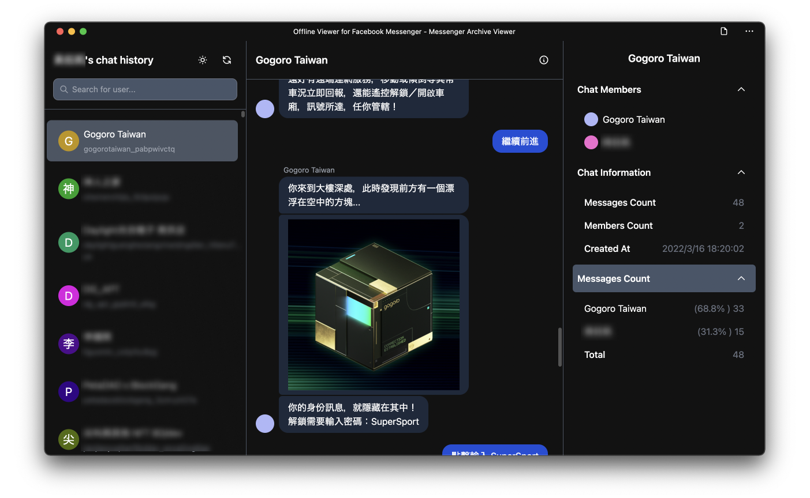
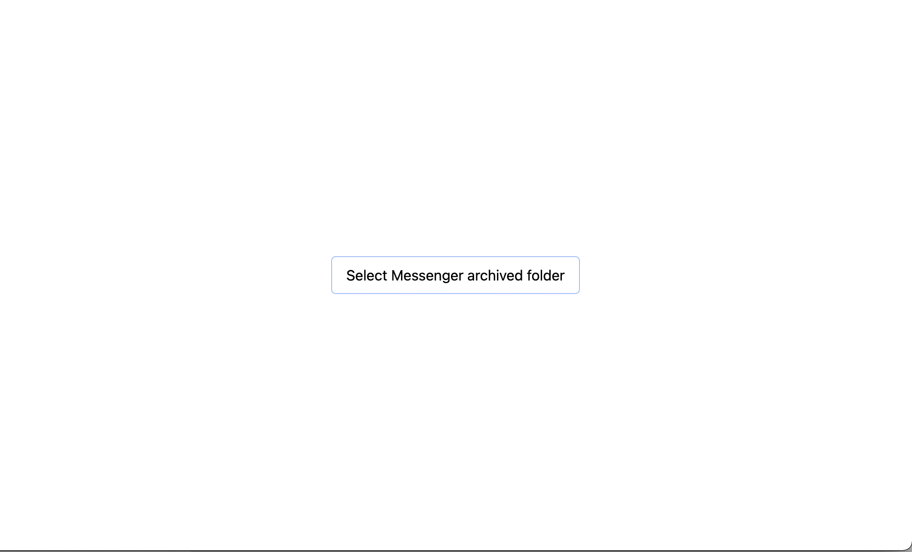
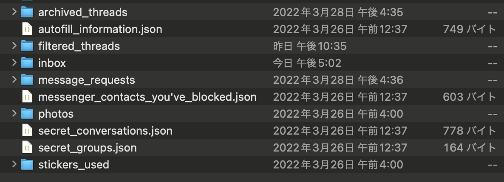
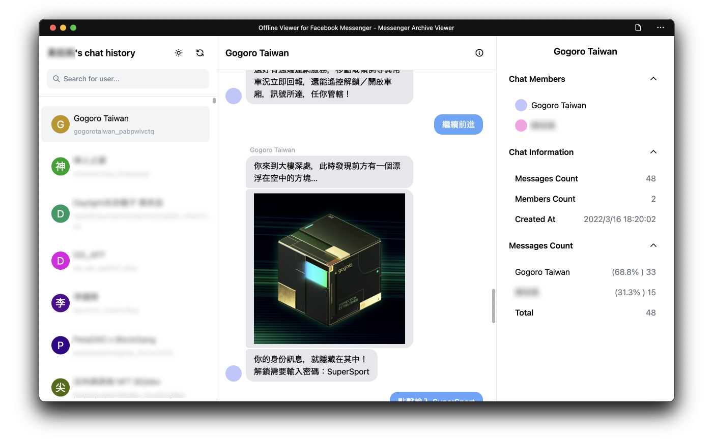
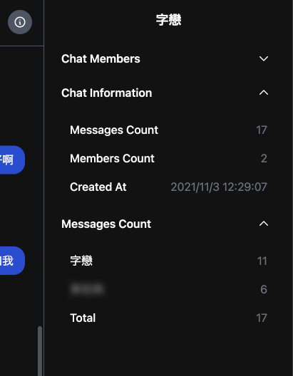
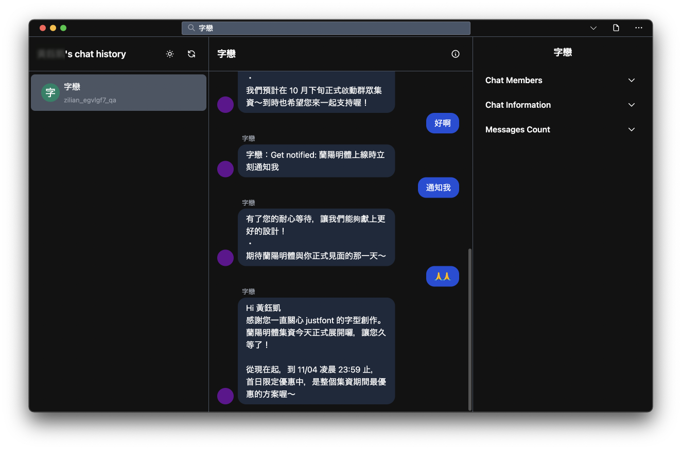

# Facebook Messenger exported JSON viewer

<p align="center">
  
</p>



## What's this?

This is a simple tool to view Facebook Messenger exported JSON files. I made the UI into a Messenger clone, just for fun and to see what Tailwind CSS can do. Another reason is that I want to try out the [File System Access API](https://developer.mozilla.org/en-US/docs/Web/API/File_System_Access_API), knowing that it can be used to access the file in a folder just in the browser.

### Technical Stack

- Next.JS + TailwindCSS
- [File System Access API](https://developer.mozilla.org/en-US/docs/Web/API/File_System_Access_API)

## How to use

1. Open [the Tool](https://messenger-json-viewer.vercel.app/)
2. Click the Button and select the folder you [downloaded from Facebook](https://www.remote.tools/remote-work/download-facebook-messenger-conversation).
   
   > The contents of the folder should look like this
   > 
3. Wait a few seconds, sometimes it takes one minute to load.
4. Tada!
   

## Features

### Simple statistic



### View chatroom just as what you can do on Messenger


### Window Controls Overlay as PWA (actually not a feature :p)



## Development (Running locally)

Before you start, make sure you have [Node.js](https://nodejs.org/) and [Yarn](https://yarnpkg.com/) installed.

First, clone the repository:

```bash
git clone https://github.com/Yukaii/messenger-JSON-viewer.git
```

Then, install the dependencies:

```bash
cd messenger-JSON-viewer
yarn install
```

Finally, run the development server:

```bash
yarn dev
```

The server should be running at http://localhost:3000.

## Docker Deployment (Recommended for production)

This application can be easily deployed using Docker. Perfect for running on a Ubuntu server while developing on Windows.

### Quick Start (Local)

```bash
mkdir archive
# Copy your messenger archive into ./archive folder

docker-compose up -d

# Access at http://localhost:3000
```

### Ubuntu Server Deployment

1. **Transfer your messenger archive to the server:**

   ```bash
   scp -r "C:\path\to\messenger\archive" user@ubuntu-server:/home/user/
   ```

2. **On the Ubuntu server:**

   ```bash
   git clone <this-repository> messenger-viewer
   cd messenger-viewer

   # Edit docker-compose.yml and set the volume path to your archive
   # volumes:
   #   - /home/user/messenger-archive:/app/archive

   docker-compose up -d
   ```

3. **Access from any device:** `http://ubuntu-server-ip:3000`

### Docker Configuration

- **ARCHIVE_PATH**: `/app/archive` (inside container)
- **Volume Mount**: Maps your local messenger archive to `/app/archive`
- **Port**: `3000` (customize in `docker-compose.yml`)
- **Auto-Load**: App automatically detects server availability and loads chats without manual import

See [DOCKER_DEPLOYMENT.md](DOCKER_DEPLOYMENT.md) for complete deployment guide and [DOCKER_QUICKSTART.md](DOCKER_QUICKSTART.md) for quick reference.

## TODOs

If they should be done, then they will be done.

- [x] Image type message
- [x] Link
- [x] Reactions
- [x] Stickers
- [ ] Subscribe/Unsubscribe events
- [ ] Attachments
- [ ] Photos View
- [ ] Calendar to jump to specific date
- Date
  - [x] Sent at for each message
  - [ ] Date/Time separator
- Info Panel
  - Statistic
    - [x] message count (from both side)

## Previous works

- <https://github.com/simonwongwong/Facebook-Messenger-JSON-viewer>

## Credits

The application icon is modified from <a href="https://heroicons.com/">Heroicons</a>.

## 其它

翻閱數年前的訊息實在是不忍直視......
